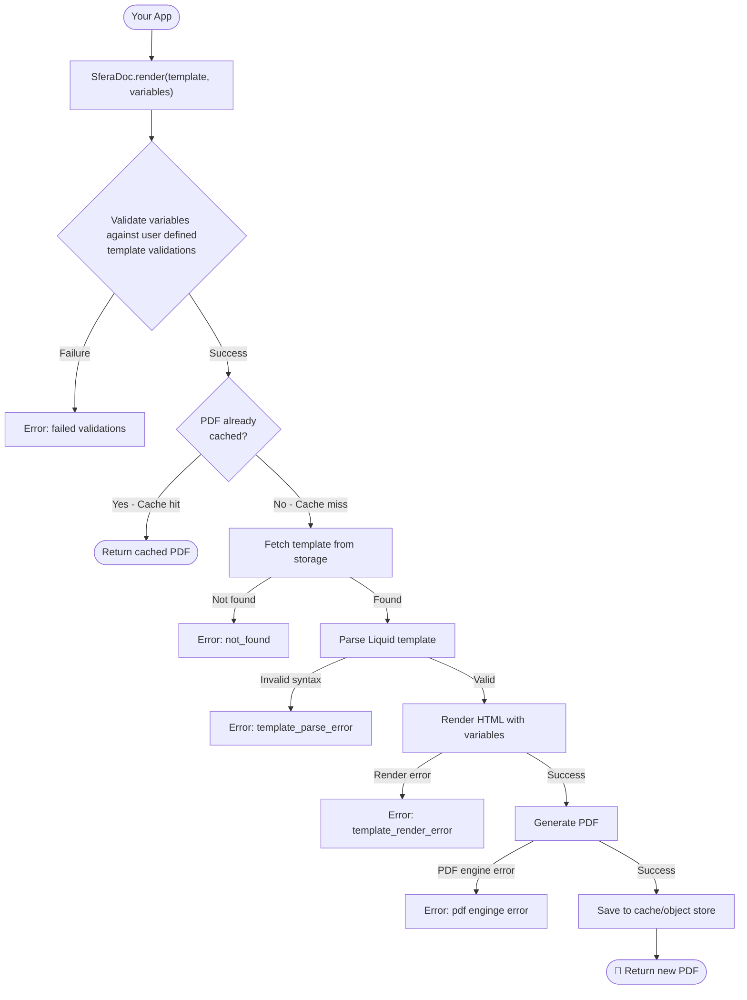
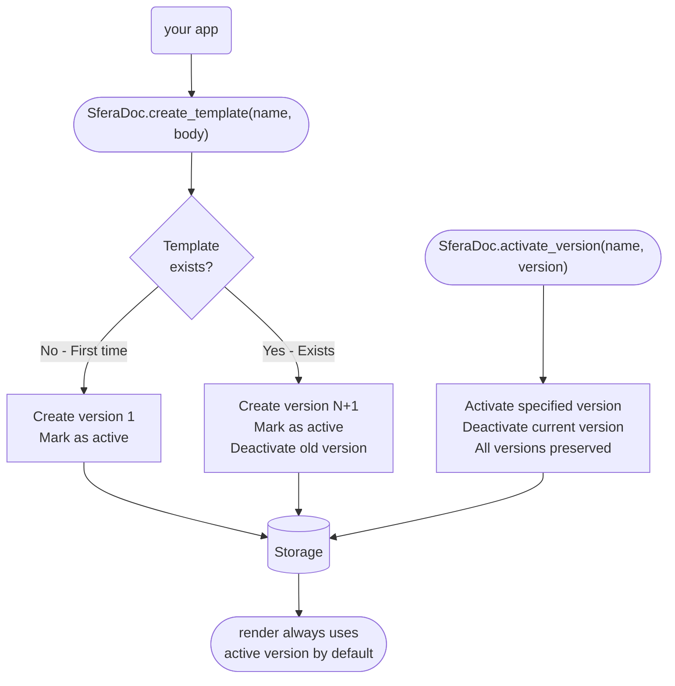

## SferaDoc

[](https://hex.pm/packages/sfera_doc) [](https://hexdocs.pm/sfera_doc/SferaDoc.html) [](https://sfera-lab.github.io/sfera-doc/)

PDF generation library for Elixir. Store versioned [Liquid](https://shopify.github.io/liquid/) templates in your database, render them to PDF via Chrome.

**Quick Links:** [Installation](#installation) · [Setup](#setup) · [Usage](#usage) · [Workflows](#workflows) · [Storage Backends](#understanding-storage-backends) · [Configuration](#configuration-reference) · [Extensibility](#extensibility)

## Features
- **Template storage**: Liquid templates stored with full version history (Ecto, ETS, or Redis)
- **Template parsing**: Powered by [`solid`](https://hex.pm/packages/solid) (default, pluggable); parsed ASTs are cached in ETS
- **PDF rendering**: HTML rendered by [`chromic_pdf`](https://hex.pm/packages/chromic_pdf) (default, pluggable)
- **Two-tier PDF storage** (optional): Fast in-memory cache (Redis/ETS) + durable object store (S3, Azure Blob, or FileSystem)
- **Variable validation**: Declare required variables per template and get clear errors before rendering

## Workflows

High-level flows showing how SferaDoc's core features work.

### Rendering PDFs

How `render/3` generates PDFs from templates and variables:



**Key concepts:**
- **Variable validation** happens first, before any rendering
- **Multi-tier caching** (optional): check cache → check object store → generate fresh
- **Template parsing** is cached separately for performance
- **Errors are specific** to help debug issues quickly

### Template Versioning

How `create_template/3` and `activate_version/2` manage versions:



**Key concepts:**
- **Calling create_template with the same name creates a new version** (v1 if new, vN+1 if exists)
- **Every call creates a new version**, previous versions are preserved
- **Only one version is active** per template name at a time
- **Rollback is safe** - activate an older version without deleting anything
- **History is permanent** until you explicitly `delete_template`

### Template Lifecycle

The full lifecycle of a template from creation to deletion:

```mermaid
flowchart LR
    Create([create_template<br/>"invoice" v1]) --> Active1[Version 1<br/>✓ Active]
    Active1 --> Update1([create_template<br/>"invoice" v2])
    Update1 --> Versions[Version 2 ✓ Active<br/>Version 1]
    Versions --> Update2([create_template<br/>"invoice" v3])
    Update2 --> MoreVersions[Version 3 ✓ Active<br/>Version 2<br/>Version 1]

    MoreVersions --> Rollback([activate_version<br/>"invoice", 1])
    Rollback --> Restored[Version 3<br/>Version 2<br/>Version 1 ✓ Active]

    Restored --> Delete([delete_template<br/>"invoice"])
    Delete --> Gone[All versions removed]

    Active1 -.->|render| PDF1[PDF output]
    Versions -.->|render| PDF2[PDF output]
    MoreVersions -.->|render| PDF3[PDF output]
    Restored -.->|render| PDF1b[PDF output]
```

**Key concepts:**
- **Templates start at version 1** when first created
- **Calling create_template again with the same name increments the version** and marks it active
- **All versions are queryable** with `list_versions/1`
- **Render always uses the active version** unless you specify `version: N`
- **Delete removes everything** - all versions are gone

## Installation

```elixir
def deps do
  [
    {:sfera_doc, "~> 0.1.0"},

    # Required if using the Ecto storage backend
    {:ecto_sql, "~> 3.10"},
    {:postgrex, ">= 0.0.0"},  # or :myxql / :ecto_sqlite3

    # Required if using the Redis storage backend
    {:redix, "~> 1.1"},

    # Required for PDF rendering
    {:chromic_pdf, "~> 1.14"},

    # Required if using the S3 PDF object store
    {:ex_aws, "~> 2.5"},
    {:ex_aws_s3, "~> 2.5"},

    # Required if using the Azure Blob PDF object store
    {:azurex, "~> 1.1"}
  ]
end
```

## Setup

### 1. Configure a storage backend

Choose a storage backend for your templates. See [Understanding storage backends](#understanding-storage-backends) for guidance on which to use.

```elixir
# config/config.exs

# Ecto (recommended for production)
config :sfera_doc, :store,
  adapter: SferaDoc.Store.Ecto,
  repo: MyApp.Repo

# Redis
config :sfera_doc, :store, adapter: SferaDoc.Store.Redis
config :sfera_doc, :redis, host: "localhost", port: 6379

# ETS: dev/test only, data is lost on restart
config :sfera_doc, :store, adapter: SferaDoc.Store.ETS
```

### 2. Create the database table (Ecto only)

Create a new migration, and copy the example migration from [`priv/migrations/create_sfera_doc_templates.exs`](priv/migrations/create_sfera_doc_templates.exs), then run the migration.

### Understanding storage backends

Storage backends persist your **template source code** and **version history**. They do not store rendered PDFs (see PDF object store for that).

| Adapter | Use case | Persistence | Multi-node |
|---|---|---|---|
| `SferaDoc.Store.Ecto` | Production: PostgreSQL, MySQL, SQLite | Durable (database) | Yes (via shared DB) |
| `SferaDoc.Store.Redis` | Distributed / Redis-heavy stacks | Durable (if Redis is persisted) | Yes (via shared Redis) |
| `SferaDoc.Store.ETS` | Development and testing only | **Lost on restart** | No (in-memory) |

**When to use each:**

- **Ecto (recommended)**: Use in production. Leverages your existing database for ACID guarantees, backups, and version history. Integrates seamlessly with Ecto migrations and your application's data model.

- **Redis**: Choose if you already run Redis in production and prefer centralizing template storage there. Supports multi-node deployments. Ensure Redis persistence is enabled (`appendonly yes` or RDB snapshots).

- **ETS**: For local development and testing only. Fast and zero-dependency, but all templates are lost when the BEAM restarts. Never use in production.

**Storage vs. Caching:**
- Storage backends hold the source templates (Liquid markup) and version metadata
- The parsed AST cache (ETS, enabled by default) speeds up template parsing
- PDF hot cache and object store (both optional) speed up rendered PDF retrieval

All layers work independently. You can mix Ecto storage with Redis PDF cache, or ETS storage (dev) with no PDF caching at all.

> **Custom storage backends:** See [Extensibility](#extensibility) for implementing custom storage adapters.

## Usage

### Create a template

```elixir
{:ok, template} = SferaDoc.create_template(
  "invoice",
  """
  <html>
  <body>
    <h1>Invoice #{{ number }}</h1>
    <p>Bill to: {{ customer_name }}</p>
    <p>Amount due: {{ amount }}</p>
  </body>
  </html>
  """,
  variables_schema: %{
    "required" => ["number", "customer_name", "amount"]
  }
)
```

### Render to PDF

```elixir
{:ok, pdf_binary} = SferaDoc.render("invoice", %{
  "number"        => "INV-0042",
  "customer_name" => "Acme Corp",
  "amount"        => "$1,200.00"
})

File.write!("invoice.pdf", pdf_binary)
```

### Missing variables

If required variables are absent, rendering is short-circuited before any parsing or Chrome calls:

```elixir
{:error, {:missing_variables, ["amount"]}} =
  SferaDoc.render("invoice", %{"number" => "1", "customer_name" => "Acme"})
```

### Template versioning

Calling `create_template/3` with the same name creates a new version and activates it. Previous versions are preserved.

```elixir
{:ok, v1} = SferaDoc.create_template("report", "<p>Draft</p>")
{:ok, v2} = SferaDoc.create_template("report", "<p>Final</p>")

# List all versions
{:ok, versions} = SferaDoc.list_versions("report")
# => [%Template{version: 2, is_active: true}, %Template{version: 1, is_active: false}]

# Render a specific version
{:ok, pdf} = SferaDoc.render("report", %{}, version: 1)

# Roll back to a previous version
{:ok, _} = SferaDoc.activate_version("report", 1)
```

### Other operations

```elixir
# Fetch template metadata (no rendering)
{:ok, template} = SferaDoc.get_template("invoice")
{:ok, template} = SferaDoc.get_template("invoice", version: 2)

# List all templates (active version per name)
{:ok, templates} = SferaDoc.list_templates()

# Delete all versions of a template
:ok = SferaDoc.delete_template("invoice")
```

## Configuration Reference

```elixir
# Storage backend (required)
config :sfera_doc, :store,
  adapter: SferaDoc.Store.Ecto,
  repo: MyApp.Repo,
  table_name: "sfera_doc_templates"   # optional, compile-time

# Redis connection (when using Redis adapter)
config :sfera_doc, :redis,
  host: "localhost",
  port: 6379

# Or with a URI:
config :sfera_doc, :redis, "redis://localhost:6379"

# Parsed template AST cache (default: enabled, 300s TTL)
config :sfera_doc, :cache,
  enabled: true,
  ttl: 300

# ChromicPDF options (passed through to ChromicPDF supervisor)
config :sfera_doc, :chromic_pdf,
  session_pool: [size: 2, timeout: 10_000]

# Template engine adapter (defaults to Solid)
config :sfera_doc, :template_engine,
  adapter: SferaDoc.TemplateEngine.Solid

# PDF engine adapter (defaults to ChromicPDF)
config :sfera_doc, :pdf_engine,
  adapter: SferaDoc.PdfEngine.ChromicPDF
```

### PDF cache (opt-in)

A fast, ephemeral first-tier cache. Repeat requests with identical variables are
served from Redis or ETS without touching the object store or Chrome.

```elixir
# Redis (distributed, recommended for multi-node)
config :sfera_doc, :pdf_hot_cache,
  adapter: :redis,
  ttl: 60          # seconds

# ETS (single-node, zero external deps)
config :sfera_doc, :pdf_hot_cache,
  adapter: :ets,
  ttl: 300
```

> **Warning:** PDFs can be 100 KB – 10 MB or more. Keep TTLs short and monitor memory.
> For Redis, set `maxmemory-policy allkeys-lru`.

### PDF object store (opt-in)

A durable, persistent second-tier storage, the **source of truth** for rendered PDFs.
PDFs survive BEAM restarts. On a cache hit the PDF is returned directly and the
first-tier cache is populated, avoiding Chrome entirely.

```elixir
# Amazon S3 (requires :ex_aws and :ex_aws_s3)
config :sfera_doc, :pdf_object_store,
  adapter: SferaDoc.Pdf.ObjectStore.S3,
  bucket: "my-pdfs",
  prefix: "sfera_doc/"   # optional

# Azure Blob Storage (requires :azurex)
config :sfera_doc, :pdf_object_store,
  adapter: SferaDoc.Pdf.ObjectStore.Azure,
  container: "my-pdfs"

# azurex credentials (can also be passed inline in the config above)
config :azurex, Azurex.Blob.Config,
  storage_account_name: "mystorageaccount",
  storage_account_key: "base64encodedkey=="

# Local / shared file system (no extra deps)
config :sfera_doc, :pdf_object_store,
  adapter: SferaDoc.Pdf.ObjectStore.FileSystem,
  path: "/var/data/pdfs"
```

Both tiers are fully independent. You can use the object store without a cache,
the cache without the object store, both together, or neither (generate on every
request, the original behaviour).

> **Custom implementations:** See [Extensibility](#extensibility) for implementing custom object stores, cache adapters, template engines, and PDF renderers.

## Telemetry

SferaDoc emits the following telemetry events:

| Event | Measurements | Metadata |
|---|---|---|
| `[:sfera_doc, :render, :start]` | `system_time` | `template_name` |
| `[:sfera_doc, :render, :stop]` | `duration` | `template_name` |
| `[:sfera_doc, :render, :exception]` | `duration` | `template_name`, `error` |

## Extensibility

SferaDoc is built with a pluggable architecture. You can implement custom adapters for any of the following components:

### Custom Storage Backends

Implement `SferaDoc.Store.Behaviour` to integrate with other databases or cloud services.

**Use cases:** CouchDB, DynamoDB, Google Cloud Datastore, custom versioning logic

**Required callbacks:**
- `put/1` - Store or version a template
- `get/1` - Get the active template by name
- `get_version/2` - Get a specific version
- `list/0` - List all active templates
- `list_versions/1` - List all versions of a template
- `activate_version/2` - Activate a specific version
- `delete/1` - Delete all versions of a template

**Example:**
```elixir
defmodule MyApp.CustomStorageBackend do
  @behaviour SferaDoc.Store.Behaviour

  # Implement all required callbacks...
end

# config/config.exs
config :sfera_doc, :store, adapter: MyApp.CustomStorageBackend
```

**Reference implementations:** [SferaDoc.Store.Ecto](https://github.com/sfera-lab/sfera-doc/blob/master/lib/sfera_doc/store/ecto.ex), [SferaDoc.Store.Redis](https://github.com/sfera-lab/sfera-doc/blob/master/lib/sfera_doc/store/redis.ex)

### Custom Template Engines

Implement a custom template parser if you want to use something other than Liquid (e.g., EEx, Mustache, Handlebars).

**Required callbacks:**
- `parse/1` - Parse template source to AST
- `render/2` - Render AST with variables to HTML

**Example:**
```elixir
defmodule MyApp.CustomTemplateEngine.EEx do
  @behaviour SferaDoc.TemplateEngine.Behaviour

  def parse(source), do: {:ok, EEx.compile_string(source)}
  def render(compiled, variables), do: {:ok, compiled.(variables)}
end

# config/config.exs
config :sfera_doc, :template_engine,
  adapter: MyApp.CustomTemplateEngine.EEx
```

**Reference implementation:** [SferaDoc.TemplateEngine.Solid](https://github.com/sfera-lab/sfera-doc/blob/master/lib/sfera_doc/template_engine/solid.ex)

### Custom PDF Engines

Implement a custom PDF renderer if you want to use something other than ChromicPDF (e.g., wkhtmltopdf, Puppeteer, WeasyPrint).

**Required callbacks:**
- `render_pdf/2` - Convert HTML to PDF binary

**Example:**
```elixir
defmodule MyApp.CustomPdfEngine do
  @behaviour SferaDoc.PdfEngine.Behaviour

  def render_pdf(html, _opts) do
    # Call custom pdf engine via port or HTTP...
    {:ok, pdf_binary}
  end
end

# config/config.exs
config :sfera_doc, :pdf_engine,
  adapter: MyApp.CustomPdfEngine.Puppeteer
```

**Reference implementation:** [SferaDoc.PdfEngine.ChromicPDF](https://github.com/sfera-lab/sfera-doc/blob/master/lib/sfera_doc/pdf_engine/chromic_pdf.ex)

### Custom PDF Object Stores

Implement `SferaDoc.Pdf.ObjectStore.Behaviour` to integrate with other object storage services.

**Use cases:** Google Cloud Storage, Cloudflare R2, Backblaze B2, MinIO, custom CDN integration

**Required callbacks:**
- `put/3` - Store a PDF
- `get/2` - Retrieve a PDF
- `delete/2` - Remove a PDF

**Example:**
```elixir
defmodule MyApp.CustomObjectStore do
  @behaviour SferaDoc.Pdf.ObjectStore.Behaviour

  def put(key, pdf_binary, _opts), do: # Upload to custom object store
  def get(key, _opts), do: # Download from custom object store
  def delete(key, _opts), do: # Delete from custom object store
end

# config/config.exs
config :sfera_doc, :pdf_object_store,
  adapter: MyApp.CustomObjectStore,
  bucket: "my-pdfs"
```

**Reference implementations:** [S3](https://github.com/sfera-lab/sfera-doc/blob/master/lib/sfera_doc/pdf/object_store/s3.ex), [Azure](https://github.com/sfera-lab/sfera-doc/blob/master/lib/sfera_doc/pdf/object_store/azure.ex), [FileSystem](https://github.com/sfera-lab/sfera-doc/blob/master/lib/sfera_doc/pdf/object_store/file_system.ex)

### Custom PDF Cache Adapters

Implement custom caching logic for the hot cache tier.

**Use cases:** Memcached, Hazelcast, custom distributed cache

**Note:** The cache adapter interface is simpler and primarily needs `get/1`, `put/3`, and `delete/1` operations.

**Reference implementations:** Built-in Redis and ETS adapters in [SferaDoc.Pdf.HotCache](https://github.com/sfera-lab/sfera-doc/tree/master/lib/sfera_doc/pdf/hot_cache)

## Contributing 

- [Development Guidlines](https://github.com/sfera-lab/sfera-doc/wiki/Development-Guidelines)


 <h1> Made with ❤️ by<span style="font-weight:700;" > <a href='https://github.com/sfera-lab/'>Sfera Lab</a></span>
</h1>


